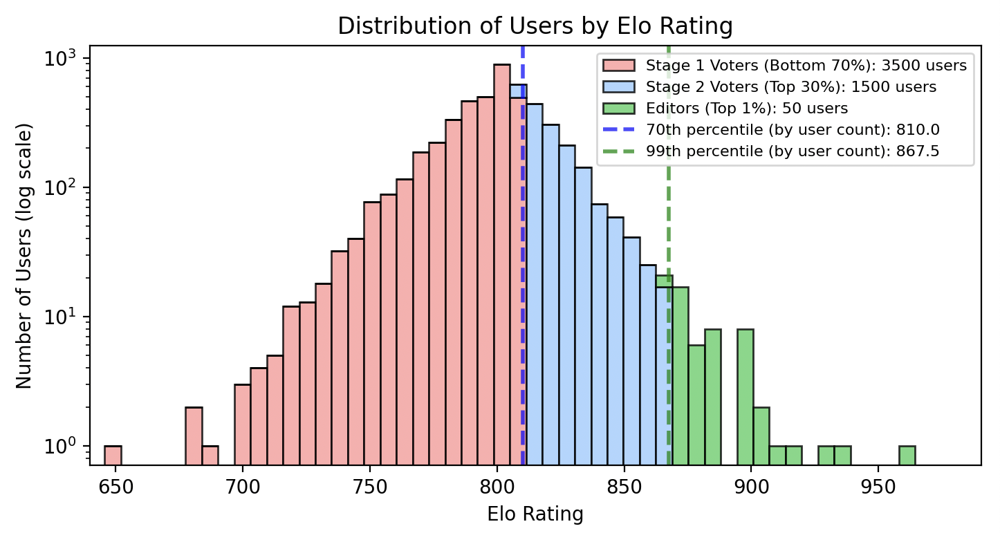

## A Whitepaper on Transparent and Scalable Community-Driven Information Curation

### Abstract

Veridonia is an experiment that introduces a novel approach to online content curation, addressing the limitations of conventional, engagement-driven systems that have fuelled sensationalism, misinformation, and the creation of echo chambers. ([1](https://doi.org/10.1016/j.tics.2021.02.007), [2](https://doi.org/10.1126/science.aao2998), [3](https://doi.org/10.1073/pnas.2023301118)) This whitepaper outlines the challenges posed by today's digital information ecosystem and details the design, architecture, and operational principles of Veridonia. Central to our approach is a framework grounded in five key principles—including transparent governance, merit-based rating, and randomized peer review—that together foster community-driven, trustworthy content curation.

### 1. Introduction

The digital landscape today is dominated by engagement metrics such as views, likes, and shares, which serve as the primary indicators of content performance. This focus on the attention economy has led to the widespread prioritisation of sensationalist content over substantive information, contributing to the rapid spread of misinformation, the formation of ideological echo chambers, and a general decline in content quality. ([1](https://doi.org/10.1016/j.tics.2021.02.007), [2](https://doi.org/10.1126/science.aao2998), [3](https://doi.org/10.1073/pnas.2023301118)) Furthermore, opaque algorithms that dictate content visibility and maximise engagement at any cost have amplified mistrust and decreased accountability ([4](https://doi.org/10.1177/1461444816676645)).

The current paradigm of social media platforms is increasingly misaligned with the broader interests of society. Rather than facilitating meaningful information exchange, these systems have evolved into attention-capture mechanisms engineered to maximise screen time. Their algorithms prioritise engagement through psychological manipulation, often at the expense of informative or socially valuable content. As a result, content with the highest emotional appeal—not necessarily the highest quality—achieves the greatest visibility, while important discourse is frequently relegated to the margins.

Veridonia is conceived as a response to these challenges. By re-engineering the content curation process, Veridonia aims to restore public trust in online content and empower communities to determine quality based on transparent, verifiable standards rather than commercial or algorithmic bias.

### 2. Problem Statement

The prevailing model for information sharing suffers from several critical flaws:

1. **Sensationalist Content Over Substantive Information:** Content is often designed to attract clicks and emotional responses rather than provide well-researched, balanced perspectives ([2](https://doi.org/10.1126/science.aao2998)).
2. **Misinformation Propagation:** The race for engagement results in the rapid spread of false or misleading information ([1](https://doi.org/10.1016/j.tics.2021.02.007)).
3. **Filter Bubbles and Echo Chambers:** Personalised algorithms confine users to ideologically homogenous groups, diminishing exposure to diverse viewpoints ([2](https://doi.org/10.1126/science.aao2998)).
4. **Opaque Decision-Making:** Hidden algorithmic processes limit transparency and accountability, fostering widespread mistrust ([4](https://doi.org/10.1177/1461444816676645)).
5. **Negative Societal Impacts:** The relentless pursuit of engagement contributes significantly to mental health issues and decreased productivity ([5](https://doi.org/10.1080/02673843.2019.1590851)).

### 3. Veridonia's Proposed Solution

Veridonia introduces a novel, community-driven approach to online content curation based on five foundational pillars:

**1. Sortition (Randomized Participant Selection)**  
Participants evaluating content are randomly selected, ensuring fairness, diversity, and resistance to manipulation.

**2. Consensus (Majority-Based Decision-Making)**  
Content decisions rely on majority voting at multiple stages, fostering community alignment and collective agreement.

**3. ELO-Based Rating System**  
A dynamic rating system based on ELO ratings rewards accurate decision-making, ensuring meritocracy and thoughtful engagement.

**4. Multi-Stage Voting Process**  
A structured, tiered voting mechanism balances efficiency with quality, using progressively qualified groups of community members to evaluate content.

**5. Transparency and Auditability**  
All moderation actions, votes, and rating adjustments are publicly recorded, ensuring full transparency and enabling independent verification. This openness safeguards the integrity of the community governance model.

This combined framework seeks to address flaws in engagement-driven platforms, aiming to restore trust and prioritize content integrity.

### 4. System Architecture

The following components detail the implementation of Veridonia’s five foundational pillars.

#### 4.1 User Onboarding and Baseline Attributes

- **IP-Based ELO Inheritance:** To protect the platform from bot attacks and coordinated manipulation, all new users inherit the ELO rating assigned to their IP address. After each voting stage, an IP address is updated to reflect the lowest ELO among its associated users. For example, if users from an IP (e.g., 156.156.156.3) have ELO ratings of 850, 700, and 1500, the IP is assigned an ELO of 700. Any new users registering from this IP will begin with an ELO of 700, capped at a default maximum (e.g., 800) for first-time IPs.
- **Initial Assignment:** If the IP address has no previous users, a default ELO rating (e.g., 800) is used.
- **Rating Development:** Users' influence in content curation evolves over time, reflecting the accuracy and consistency of their judgements.

#### 4.2 Submission & Review Pipeline

Veridonia evaluates each post through a single, transparent pipeline that combines sortition (random sampling) and tiered majority voting. Random selection at each stage promotes fairness and diversity; tiering by rating concentrates final authority among proven reviewers without excluding broader participation. The mechanism scales with community size: as the population grows, random selection becomes harder to game; in very small communities the system collapses to a simpler single-stage vote.

**Process Flow**

1. **Submit** — The author submits a post to a specific community; the system records a permanent, auditable trail.

2. **Stage 1 — Initial Filter (lower 70% ELO)** — A random sample from the lower 70% of ELO within that community reviews the post for quality and community alignment.  
   **Outcome:**

   - If a simple majority approves, the post advances to Stage 2.
   - If a simple majority rejects, the post is rejected.  
     **Rating:** After this decision, rating adjustments are applied to Stage‑1 participants independently of Stage‑2 outcomes.

3. **Stage 2 — Final Decision (top 30% ELO)** — A random sample drawn from the top 30% of ELO issues the final decision by simple majority.  
   **Outcome:** The post is either **published** or **not published** based on the majority vote.  
   **Rating:** Rating adjustments are applied to Stage‑2 participants after the final decision.

4. **Small‑Population Mode** — For communities with fewer than 20 members, a single random sample is drawn from all available users. A simple majority decides whether to publish. Rating adjustments are applied to those participants.

**Rationale and Manipulation Resistance**

- **Sortition:** Random selection reduces the viability of targeted manipulation and collusion.
- **Tiering by rating:** Final decisions are made by consistently accurate reviewers while keeping early checks broad to reflect community diversity.
- **Scalability:** Larger communities increase the entropy of selection, making coordinated capture more difficult; niche communities remain viable due to focused interests.
- **Transparency:** All votes, outcomes, and subsequent rating changes are publicly logged for auditability.

#### 4.3 ELO-Based Rating System

As one of Veridonia's five foundational pillars, the ELO-based rating system plays a key role in supporting its meritocratic model:

- **Dynamic Influence:** Users' ELO ratings not only reflect their decision-making accuracy but also serve as a gateway to enhanced moderation privileges. As users consistently align with community standards and see their ratings increase, they become eligible for promotion from the initial tier to higher groups—Stage 2 group. These promotions grant them greater influence over content curation and the overall quality of the platform.
- **Zero-Sum, Team-Weighted ELO Updates:** After the final decision, voters split into two teams: **winners** (their vote matches the outcome) and **losers** (their vote does not). Rating is reallocated strictly zero-sum between these teams and weighted by their relative strength:

  1. Compute each team’s average ELO (winners_avg, losers_avg).
  2. For each participant, compute an update scaled by a constant **K** and the gap between team averages. Members of the **winners** gain ELO, moving upward toward the opposing team’s average; members of the **losers** lose ELO, moving downward toward the opposing team’s average.
  3. The sum of all gains equals the sum of all losses (zero-sum conservation).

  4. This team-weighted update rewards collective accuracy and gradually concentrates influence in consistently correct voters whilst penalising systematic misjudgement.

**Example — One Voting Stage**

Suppose five users have been selected to vote on whether a suggested post A should be published to a community X.

Their initial ratings are **800, 755, 821, 798,** and **804.**  
Three vote **Yes** (users 1, 4, 5) and two **No** (2, 3). The majority outcome is **Yes**.

**Step 1 — Compute team averages**

\[
\mu_W = (800 + 798 + 804) / 3 = 800.67
\]
\[
\mu_L = (755 + 821) / 2 = 788.00
\]

**Step 2 — Expected score for winners**

\[
E_W = \frac{1}{1 + 10^{(\mu_L - \mu_W)/400}} = \frac{1}{1 + 10^{(788.00 - 800.67)/400}} \approx 0.518
\]

**Step 3 — Rating transfer**

\[
K = 32
\]
\[
\text{Total gain for winners} = K \times (1 - E_W) = 15.4
\]
\[
\text{Total loss for losers} = -15.4
\]

**Step 4 — Distribution**

Each winner gains \(+15.4 / 3 = +5.1\)  
Each loser loses \(−15.4 / 2 = −7.7\)

After this round, the new ratings are approximately:  
(805, 747, 813, 803, 809)

Although this example describes only one isolated voting stage, the same mechanism repeats continuously across thousands of decisions and participants. Each round transfers small amounts of reputation between more and less accurate voters, and over time these micro-adjustments accumulate into a stable equilibrium. When simulated over many iterations, the system self‑organises into a characteristic distribution of ratings—most users cluster around the mean, with smaller groups at the extremes corresponding to the more and less consistent reviewers. The figure below shows this emergent pattern.

**Figure 1: Distribution of Users by ELO Rating (Simulation Data)**  
_Simulation results showing the equilibrium state produced by repeated voting and rating updates. Most users cluster around the mean, with progressively smaller groups at higher and lower ratings defining the Stage 1, Stage 2, and Editor tiers. Dashed lines mark the 70th and 99th percentiles by user count._

**Local Rating & Elected Cross-Community Stewards (TBD)**  
Rating (ELO) remains **strictly local to each community**. A user's standing in one community neither boosts nor suppresses their standing in another, and **no global ELO** is ever computed. This prevents the rise of "universal elites" and keeps influence contextual to demonstrated expertise.

In the future, Veridonia may introduce a small set of elected cross‑community stewards ("chief editors") with limited administrative powers (e.g., emergency takedowns, cross‑community maintenance). Details of their election, scope, and accountability are **to be determined** and may draw inspiration from Wikipedia’s steward model. Crucially, these roles would not mix or merge community ratings, and routine content decisions would remain governed locally.

#### 4.4 ELO-Based Throttling Mechanism

Veridonia implements a sophisticated throttling system that regulates users' ability to post and comment based on their ELO ratings:

- **Rate Limiting:** Users with lower ELO ratings face greater restrictions on how frequently they can post content or comment. This throttling mechanism scales dynamically with ELO scores, and users with particularly low rating may be limited to posting only once per hour, per day, or even per week, depending on the severity of their low ELO.
- **Cooldown Periods:** After posting or commenting, users experience a mandatory cooldown period before they can contribute again. The duration of this cooldown is inversely proportional to their ELO rating.
- **Progressive Relaxation:** As users demonstrate consistent quality contributions and their ELO increases, throttling restrictions are gradually relaxed, allowing for more frequent participation.

The throttling mechanism serves several critical functions:

1. **Quality Control:** By limiting the volume of content from users with lower rating scores, the system naturally elevates the average quality of visible content.
2. **Spam Prevention:** Rate limiting creates an effective barrier against automated spam and coordinated manipulation attempts.
3. **Incentivizing Quality:** The direct relationship between contribution privileges and ELO motivates users to focus on thoughtful, community-aligned contributions rather than quantity.
4. **Self-Regulation:** The system creates a natural self-regulatory environment where users who consistently provide low-quality content have diminished impact on the community.
5. **Resource Management:** Throttling helps manage computational resources by preventing system overload from excessive low-quality submissions.

This mechanism reinforces Veridonia's core principle that influence within the community should be earned through demonstrated alignment with community standards and quality contribution.

### 5. Transparency and Self-Governance

Veridonia is designed to be an open and self-regulating ecosystem:

- **Public Auditability:** All voting records, ELO adjustments, and moderation actions are logged and accessible for independent review, emulating blockchain-like transparency. These community standards are shaped through historical voting patterns and collective moderation, and they evolve over time.
- **Decentralised Moderation:** Governance is vested in the community, with every member (including guests) empowered to contribute, vote, and shape content standards. Moderation rights are held by approximately the top 1% of users in a community by rating, who are able to soft-delete posts to uphold standards. Every moderation action is publicly logged, ensuring accountability, and any such action can be appealed by the broader community through a randomized jury voting process.

**Privacy by Design and Data Control:**  
Veridonia does not require sign-up to participate and does not track users across the web. The system only uses minimal signals necessary for fairness—for example, new accounts inherit the lowest rating from their IP to discourage bot farms. Beyond this, rating is tied entirely to actions within the platform: voting, posting, and how those decisions align with the community.

At the same time, users retain full control of their data. All activity histories can be accessed and verified without compromising security, reinforcing both transparency and individual privacy.

### 6. Additional Core Principles

- **Independence from Advertiser Influence:** Veridonia is free from advertiser funding, ensuring that content curation remains unbiased and dictated solely by community standards. The platform will never employ advertising as a monetisation strategy. Instead, future revenue models may involve subscriptions or donations, but public benefit content—such as community feeds—will always remain free to access. Only private benefit features may be offered as paid options, balancing sustainability with Veridonia’s commitment to open access and public good.

- **User Empowerment:** The platform is structured to empower users, granting them direct oversight of the content curation process without the interference of centralised authorities.

### 7. Conclusion

Veridonia is an experiment in community‑driven curation. By pairing sortition and tiered voting with an ELO‑based rating, it exchanges engagement optimisation for incentives that make judgement matter: low‑quality contributions carry rating and throttling costs, while careful, community‑aligned decisions expand a user's influence. The hypothesis is straightforward: if incentives reward diligence and shared standards, the system should produce online feeds that are higher in quality and more trustworthy.

The next step is empirical: pilot deployments, red‑team pressure, and measurement. We will track content quality, capture resistance, decision latency vs. accuracy, fairness of IP‑based inheritance, and the usability of the audit trail. Some elements (e.g., cross‑community stewards) remain open for design.

A second question is sustainability. We will evaluate whether a non‑advertising model—driven by voluntary support or subscriptions—can fund operations without distorting incentives, while keeping core public‑benefit features open.

Ultimately, Veridonia is a falsifiable proposal. If outcomes under real use do not beat practical baselines—or if funding compromises the aims—it should be revised or retired. If they do, the system may be worth iterating on. We invite researchers and communities to test, critique, and adapt these ideas.

### References

1. Pennycook, G., & Rand, D. G. (2021). "The Psychology of Fake News." _Trends in Cognitive Sciences_, 25(5), 388–402. [https://doi.org/10.1016/j.tics.2021.02.007](https://doi.org/10.1016/j.tics.2021.02.007)

2. Lazer, D. M. J., Baum, M. A., Benkler, Y., Berinsky, A. J., Greenhill, K. M., Menczer, F., & Zittrain, J. L. (2018). "The Science of Fake News." _Science_, 359(6380), 1094–1096. [https://doi.org/10.1126/science.aao2998](https://doi.org/10.1126/science.aao2998)

3. Cinelli, M., Morales, G. D. F., Galeazzi, A., Quattrociocchi, W., & Starnini, M. (2021). "The Echo Chamber Effect on Social Media." _Proceedings of the National Academy of Sciences_, 118(9). [https://doi.org/10.1073/pnas.2023301118](https://doi.org/10.1073/pnas.2023301118)

4. Ananny, M., & Crawford, K. (2018). "Seeing without Knowing: Limitations of the Transparency Ideal and Its Application to Algorithmic Accountability." _New Media & Society_, 20(3), 973–989. [https://doi.org/10.1177/1461444816676645](https://doi.org/10.1177/1461444816676645)

5. Keles, B., McCrae, N., & Grealish, A. (2020). "A Systematic Review: The Influence of Social Media on Depression, Anxiety, and Psychological Distress in Adolescents." _International Journal of Adolescence and Youth_, 25(1), 79–93. [https://doi.org/10.1080/02673843.2019.1590851](https://doi.org/10.1080/02673843.2019.1590851)
